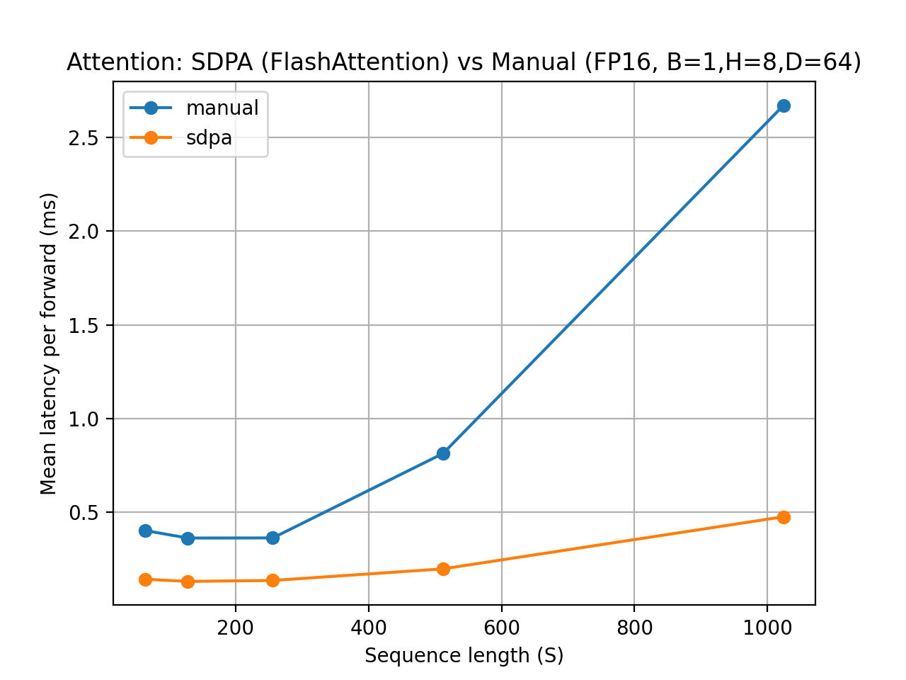
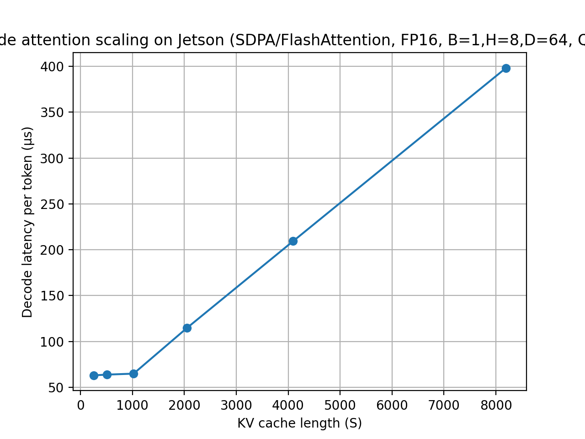
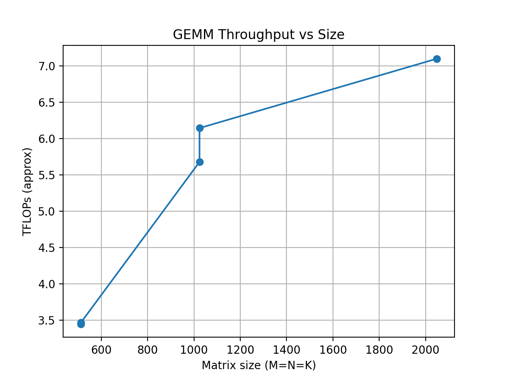

# Edge LLM GPU Profiling — Jetson Orin Nano

A profiling suite that measures the GPU kernels behind LLM inference — **attention** and **KV-cache decode** — on an **NVIDIA Jetson Orin Nano** (15 W edge SoC), to find what bottlenecks low-cost local LLM-agent deployment. Profiled with **Nsight Systems** and PyTorch on JetPack.

## Key results (Jetson Orin Nano, fp16)

| Result | Value | Source |
|---|---|---|
| Fused **SDPA / FlashAttention** vs naive matmul→softmax→matmul attention (S=1024) | **5.55× lower p50 latency** | `results/raw_csv/attn_compare.csv` |
| Single-stream **KV-cache decode** throughput @ 1K context | **~15.4K tokens/sec** (64.9 µs/token) | `results/raw_csv/decode_kv_sweep.csv` |
| Decode latency scaling (context 256 → 8192) | **63.1 → 398.1 µs/token** | `results/raw_csv/decode_kv_sweep.csv` |
| Peak fp16 GEMM throughput | **7.46 TFLOP/s** (1024³, batch 16) | `results/raw_csv/bench.csv` |

The decode sweep shows the expected memory-bound behavior: throughput is flat (~15.6–15.9K tok/s) up to ~1K context, then falls off as the KV cache grows (~8.7K @ 2K, ~2.5K @ 8K). Nsight traces show the matching **per-token kernel-launch pattern** — one `cudaLaunchKernel` per decode step — which is the classic small-batch decode overhead on constrained hardware.

## Plots







## Methodology

- **Attention** (`src/attn_bench.py`, `src/attn_bench_events.py`): fused `scaled_dot_product_attention` (FlashAttention backend) vs a hand-rolled matmul→softmax→matmul path, swept over sequence length, CUDA-event timed (p50/p95/p99).
- **KV-cache decode** (`src/kv_decode_bench.py`, `src/kv_decode_microbatch.py`): single-query decode step swept over KV-cache length, reported as µs/token.
- **GEMM** (`src/bench.py`): batched fp16 GEMM throughput sweep with full device/JetPack metadata captured per row.
- **Profiling**: Nsight Systems captures (kept locally, gitignored) confirm the FlashAttention kernel and the per-step launch overhead; CSV summaries are committed under `results/raw_csv/`, plots under `results/plots/` (`src/plot.py`).

## Hardware / software

NVIDIA **Jetson Orin Nano** (Ampere, tegra234) · **15 W** power mode · JetPack **R36.4.7** · PyTorch **2.5** (nv24.08) · CUDA **12.6** · cuDNN 9.3 · 7.44 GB RAM. Full env is stamped into every row of `bench.csv`.

## Reproduce

```bash
python src/bench.py            # GEMM sweep -> results/raw_csv/bench.csv
python src/attn_bench.py       # SDPA vs manual attention
python src/kv_decode_bench.py  # KV-cache decode sweep
python src/plot.py             # regenerate results/plots/
```

## Honest notes / limitations

- Workloads are **synthetic attention/GEMM/decode shapes** (B=1, H=8, D=64 random tensors), **not a fully loaded LLM** — they isolate the kernels, not end-to-end model serving.
- Tokens/sec is **derived from single-stream decode latency** (1 / µs-per-token), not a batched serving throughput.
- The "kernel-fusion bottleneck" finding is the SDPA-vs-naive gap plus the Nsight launch-pattern trace; it characterizes the kernels rather than optimizing a deployed model.

## Author

**Harshith Kantamneni** — MS ECE, UW-Madison. GPU performance engineering, LLM-inference profiling, edge accelerators.
